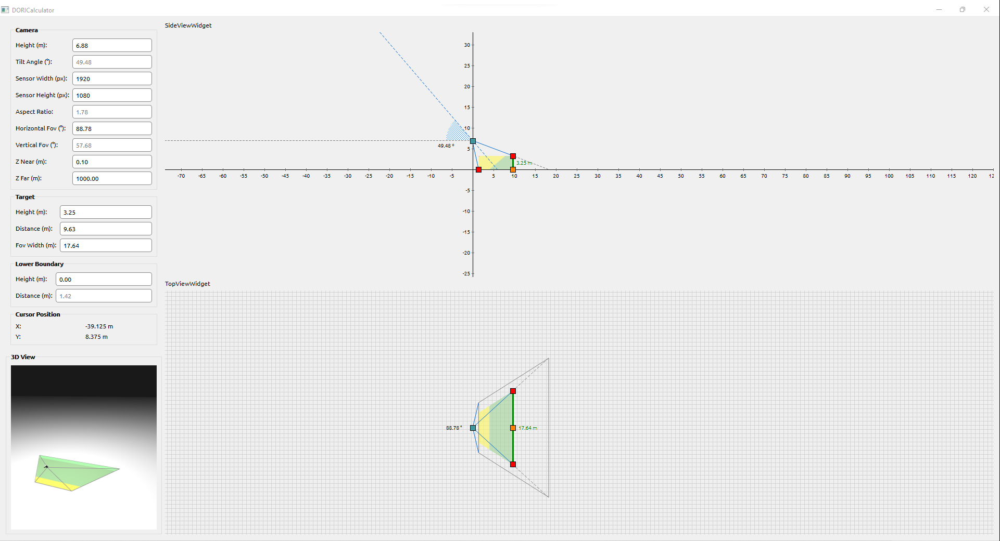

# DORI Calculator
- Keywords: C++, Qt 6, Eigen, OpenGL and GLSL
- DORI (Detection - Observation - Recognition - Identification) limit calculator based on  IEC EN62676-4: 2015 International Standard.

